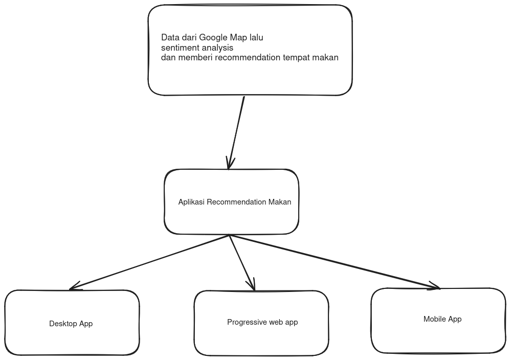

### Recommendation Rumah Makan

"SugestiSaji" adalah proyek yang bertujuan untuk menciptakan platform inovatif yang menyediakan rekomendasi kuliner dan rumah makan kepada pengguna berdasarkan preferensi, lokasi, dan ulasan pengguna lainnya. Platform ini dirancang untuk memberikan pengalaman pengguna yang lebih personal dan memudahkan mereka menemukan tempat makan yang sesuai dengan selera dan kebutuhan merek.

Feature:

1. Ulasan dan Penilaian Pengguna: Pengguna dapat memberikan ulasan dan penilaian untuk tempat makan yang mereka kunjungi, serta melihat ulasan dari pengguna lain. Ini membantu pengguna lain untuk membuat keputusan yang lebih baik saat memilih tempat makan
2. Mood Detection : Pengguna dapat melihat mood (kepercayaan) mereka terhadap tempat makan yang mereka kunjungi. Ini membantu pengguna dalam memilih tempat makan yang sesuai dengan mood mereka

Roadmap:

Tujuan dari proyek SugestiSaji adalah untuk memberikan solusi yang intuitif dan efektif bagi pengguna yang ingin menemukan tempat makan yang sesuai dengan preferensi dan kebutuhan mereka. Dengan menggabungkan teknologi rekomendasi canggih dengan fitur-fitur interaktif, platform ini diharapkan dapat meningkatkan pengalaman kuliner pengguna dan mendukung industri makanan dan minuman lokal.
